# Big Data Amazon Reviews:
## Level-1:

### In level-1 of this assignment, the ETL skills are performed in cloud using Google Colab PySpark for handling big data.

- The initial step was to read in the datafile from AWS S3 Bucket.

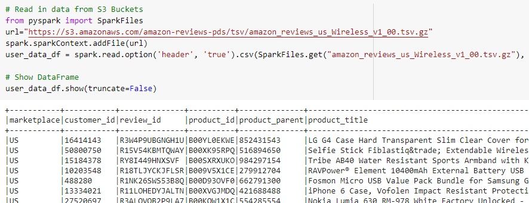

- Next, the preprocessing steps are performed.

- Drop the null values from the datset.

- 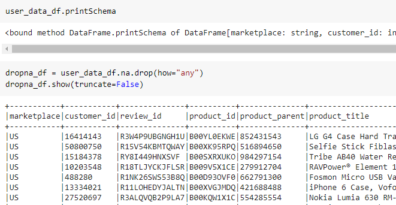

- Investigate the number of rows and columns in the dataset.

- 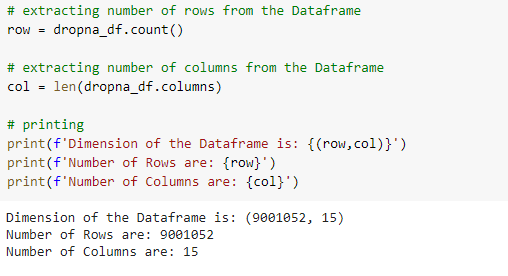

- The data types of the columns are reassigned.

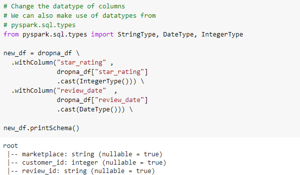

- Removing the empty spaces before and after the values.

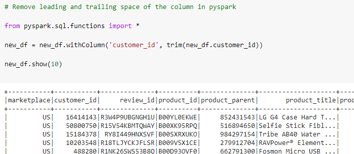

- Four dataframes are created to match the schema provided for PostgreSql database.

- The first dataframe is the review_df.

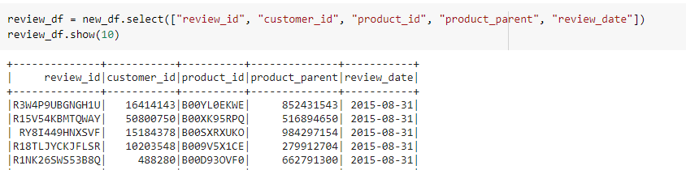

- Second, the customer_df is created.

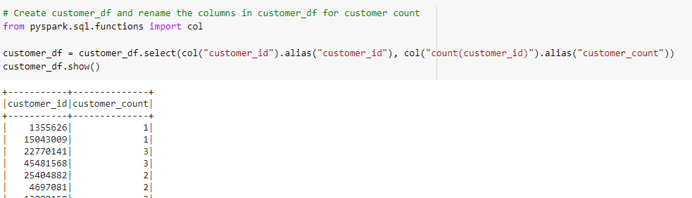

- Next, columns are selected for the product_df.

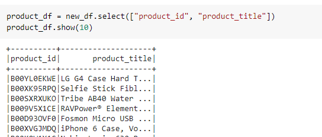

- And finally, the vine_df is prepared for the analysis.

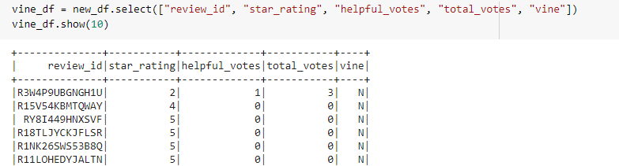

- The task after creating the dataframes using Google Colab PySpark, is to create a relational database (RDS) in Amazon Web Services (AWS). 

- And the dataframes are uploaded in 'Amazon Relational Database' to be accessable for further processing in PostgreSQl.

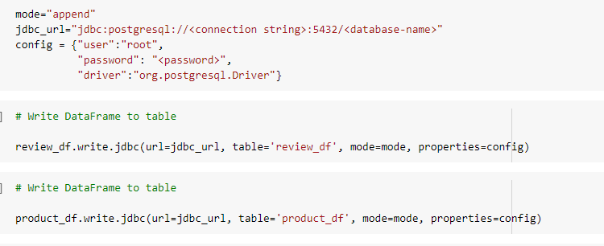

## Level-2:

### The task in level two is to analyze whether the reviews from Amazon's Vine program are trustworthy or not.

- The file is uploaded in the seond notebook and the preprocessing steps are performed.

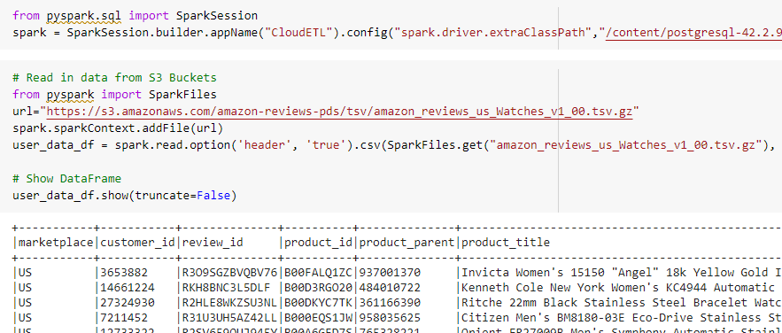

- Next, the statistical analysis is done on the vine reviews.

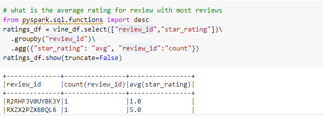

